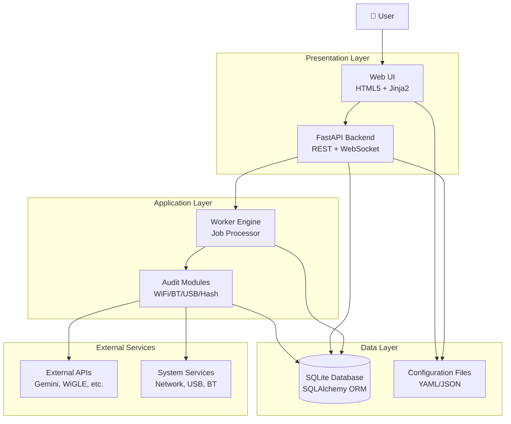
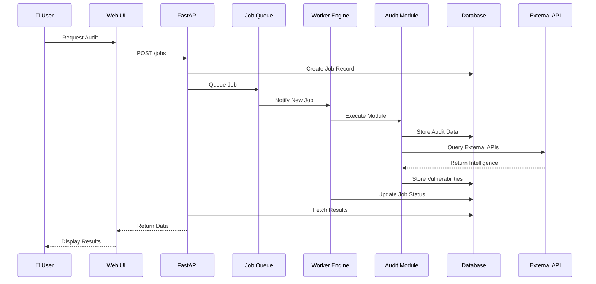
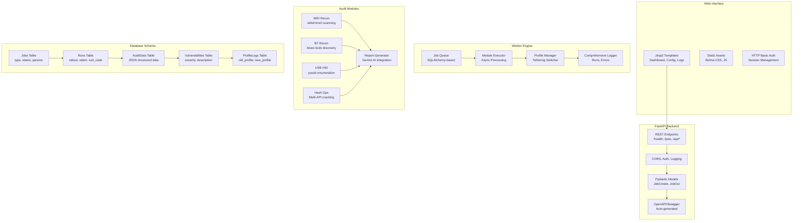
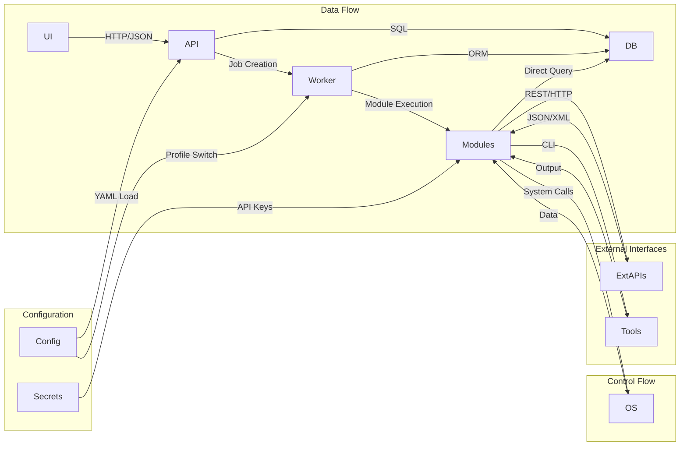
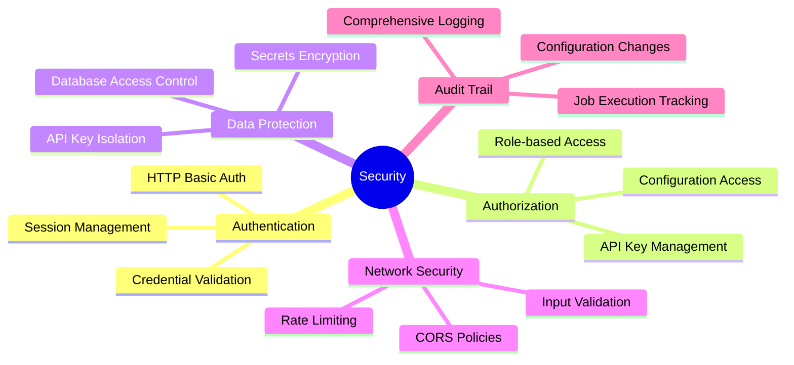

# 🔐 Subzero-Blackbox

**Cyber-security Swiss Army Knife for Raspberry Pi Zero 2W**

*Wi-Fi/Bluetooth/USB HID Auditing System with AI-Powered Analysis*

[](https://github.com/yonrasgg)
[](LICENSE)
[](https://python.org)

---

## 📋 Table of Contents

- [🎯 Overview](#-overview)
- [🏗️ Architecture](#️-architecture)
- [✨ Features](#-features)
- [🚀 Quick Start](#-quick-start)
- [📚 Documentation](#-documentation)
- [🔧 API Reference](#-api-reference)
- [📋 TODOs & Roadmap](#-todos--roadmap)
- [🤝 Contributing](#-contributing)
- [📄 License](#-license)
- [🙏 Acknowledgments](#-acknowledgments)

---

## 🎯 Overview

**Subzero-Blackbox** is a comprehensive cybersecurity auditing platform designed specifically for the Raspberry Pi Zero 2W. It combines passive and active reconnaissance capabilities with AI-powered analysis to provide security professionals and researchers with a powerful, portable auditing toolkit.

### 🎯 Mission
To democratize cybersecurity auditing by providing an affordable, powerful, and intelligent auditing platform that can be deployed anywhere with just a Raspberry Pi Zero 2W.

### 🔑 Key Capabilities
- **Wi-Fi Auditing**: Passive network scanning, vulnerability assessment, rogue AP detection
- **Bluetooth Auditing**: Device discovery, pairing analysis, security assessment
- **USB HID Auditing**: Device impersonation detection, malware delivery prevention
- **AI-Powered Analysis**: Machine learning-driven vulnerability correlation and reporting
- **Real-time Monitoring**: Hardware stats, API usage tracking, system health
- **Offline Operation**: No internet required for core auditing functions

---

## 🏗️ Architecture

Subzero-Blackbox sigue una arquitectura modular de 4 capas basada en el patrón **Producer-Consumer** con separación clara de responsabilidades. El sistema está diseñado para entornos de recursos limitados (Raspberry Pi Zero 2W) con énfasis en eficiencia, seguridad y extensibilidad.

### 📊 **Arquitectura General**



### 🔄 **Flujo de Datos**



### 🧩 **Componentes Detallados**



### 🔗 **Relaciones Técnicas**



### 🏛️ **Core Components**

#### **1. Web Interface Layer**
- **Framework**: HTML5 + Bulma CSS + Jinja2 Templates
- **Responsabilidades**: 
  - Renderizado de UI responsive
  - Gestión de formularios de configuración
  - Visualización de dashboards en tiempo real
  - Navegación entre vistas de auditoría
- **Endpoints**: `/ui/dashboard`, `/ui/config`, `/ui/logs`, `/ui/jobs/{id}`

#### **2. API Backend Layer**
- **Framework**: FastAPI (ASGI) con SQLAlchemy ORM
- **Autenticación**: HTTP Basic Auth con secrets.compare_digest()
- **Middleware**: CORS para acceso cross-origin, logging estructurado
- **Endpoints RESTful**:
  - `GET /health` - Health checks
  - `POST /jobs` - Creación de trabajos
  - `GET /api/hardware` - Estadísticas de hardware
  - `GET /api/cves` - Consultas CVE externas
- **WebSocket**: Actualizaciones en tiempo real (futuro)

#### **3. Worker Engine Layer**
- **Patrón**: Producer-Consumer con cola SQL-based
- **Gestión de Jobs**: Estados (queued → running → finished/error)
- **Ejecución de Módulos**: Importación dinámica y ejecución aislada
- **Manejo de Perfiles**: Cambio dinámico de configuración del sistema
- **Logging**: Captura de stdout/stderr, códigos de salida, timestamps

#### **4. Audit Modules Layer**
- **WiFi Recon**: 
  - Escaneo pasivo con `iwlist`/`nmcli`
  - Análisis de encriptación y vulnerabilidades
  - Correlación con bases CVE (OpenCVE, NVD)
  - Almacenamiento estructurado de datos de red
- **BT Recon**: 
  - Descubrimiento con `bluetoothctl`/`hcitool`
  - Análisis de servicios SDP
  - Evaluación básica de seguridad de emparejamiento
- **USB HID**: 
  - Enumeración con `pyusb`
  - Análisis de dispositivos conectados
  - Monitoreo de actividad USB
- **Hash Operations**: 
  - Integración multi-API (OnlineHashCrack, WPA-Sec)
  - Gestión de claves API desde secrets.yaml
  - Almacenamiento de resultados de cracking
- **Report Generator**: 
  - Integración Google Gemini AI
  - Generación de reportes narrativos
  - Correlación inteligente de hallazgos

#### **5. Data Persistence Layer**
- **Engine**: SQLite con WAL mode para concurrencia
- **ORM**: SQLAlchemy con modelos tipados
- **Tablas Principales**:
  - `jobs`: Metadatos de trabajos de auditoría
  - `runs`: Ejecuciones específicas de módulos
  - `audit_data`: Datos recolectados (JSON flexible)
  - `vulnerabilities`: Hallazgos de seguridad estructurados
  - `profile_logs`: Historial de cambios de configuración
- **Índices**: Optimizados para consultas por job_id, timestamps
- **Migraciones**: Automáticas con SQLAlchemy

### 🔐 **Security Architecture**



### 📈 **Performance Considerations**

- **Memoria Limitada**: Diseño para Raspberry Pi Zero 2W (512MB RAM)
- **Procesamiento Asíncrono**: Jobs en background sin bloquear UI
- **Base de Datos Ligera**: SQLite con consultas optimizadas
- **APIs Externas**: Rate limiting y error handling robusto
- **Monitoreo de Recursos**: CPU, memoria, batería en tiempo real

---

## ✨ Features

### 🔍 **Auditing Capabilities**

#### **Wi-Fi Auditing**
- ✅ Passive network scanning (iwlist/nmcli integration)
- ✅ Vulnerability assessment (open networks, encryption analysis)
- ✅ Manufacturer MAC analysis via integrated database
- ✅ Captive portal detection
- ✅ CVE correlation with external APIs (OpenCVE, NVD, CVE Search)
- ✅ Structured data collection for reporting

#### **Bluetooth Auditing**
- ✅ Device discovery and enumeration
- ✅ Basic pairing and service analysis
- ✅ Device information collection
- ✅ Structured audit data storage

#### **USB HID Auditing**
- ✅ Device identification and enumeration
- ✅ Basic firmware and device analysis
- ✅ USB device monitoring and logging

### 🤖 **AI & Machine Learning**

#### **Implemented Features**
- ✅ AI Assistant with personality (Rayden/Subzero characters)
- ✅ API usage tracking for system intelligence
- ✅ Structured audit data collection for future ML training
- ✅ AI-powered report generation with Google Gemini
- 🔄 Vulnerability correlation and analysis

#### **Future Enhancements**
- 📋 Predictive threat analysis
- 📋 Behavioral pattern recognition
- 📋 Automated security recommendations

### 📊 **Monitoring & Analytics**

#### **Real-time Dashboard**
- 📈 Hardware statistics (CPU, RAM, Battery)
- 📈 Job queue status
- 📈 Active profile monitoring
- 📈 API usage metrics

#### **Comprehensive Logging**
- 📝 Job execution logs
- 📝 Vulnerability findings
- 📝 Audit data collection
- 📝 Profile change history
- 📝 System events

### 🔧 **System Management**

#### **Profile System**
- 🔄 Stealth Recon: Minimal footprint scanning
- 🔄 Aggressive Recon: Active testing and exploitation
- 🔄 Wi-Fi Audit: Wireless security assessment
- 🔄 Bluetooth Audit: BT security evaluation
- 🔄 USB Audit: HID device analysis

#### **Dual Tethering**
- 📡 Wi-Fi Hotspot mode
- 📡 Bluetooth PAN mode
- 📡 Automatic failover
- 📡 Internet connectivity management

---

## 🚀 Quick Start

### 📦 **Prerequisites**
- Raspberry Pi Zero 2W (or compatible)
- MicroSD card (32GB+ recommended)
- USB Wi-Fi adapter (optional, for extended range)
- Bluetooth adapter (optional, for BT auditing)

### 🛠️ **Installation**

#### **Automated Setup (Recommended)**
```bash
# Clone the repository
git clone https://github.com/yonrasgg/subzero-blackbox.git
cd subzero-blackbox

# Run installation script (installs everything automatically)
sudo ./scripts/install.sh
```

The installation script will:
- ✅ Install all required system dependencies
- ✅ Create production environment at `/opt/blackbox`
- ✅ Set up Python virtual environment
- ✅ Install Python dependencies
- ✅ Initialize the database
- ✅ Create systemd services for auto-start
- ✅ Configure API keys template
- ✅ Start the services automatically

After installation, you'll need to:
1. **Configure your API keys**: `sudo nano /opt/blackbox/config/secrets.yaml`
2. **Access the web interface**: `http://[YOUR_RPI_IP]:8010/ui/home`

#### **Manual Setup (Advanced Users Only)**
If you prefer manual installation or need custom configuration:

```bash
# Install system dependencies
sudo apt update
sudo apt install -y \
    python3 python3-pip python3-venv \
    sqlite3 wireless-tools iw bluetooth bluez-tools \
    usbutils net-tools curl git rsync

# Create virtual environment
python3 -m venv venv
source venv/bin/activate

# Install Python dependencies
pip install -r requirements.txt

# Initialize database
python scripts/init_db.py

# Configure API keys
cp config/secrets.yaml.example config/secrets.yaml
# Edit with your API keys: nano config/secrets.yaml
```

### ⚙️ **Configuration**

#### **Basic Configuration** (`config/config.yaml`)
```yaml
environment: dev
raspi_id: subzero
ui:
  username: admin
  password: change-this

wifi_audits:
  enable_vulnerability_scan: true
  scan_types:
    - open_networks
    - weak_passwords
    - outdated_protocols

bt_audits:
  enable_vulnerability_scan: true
  scan_types:
    - bluejacking
    - pairing_vulnerabilities

usb_audits:
  enable_vulnerability_scan: true
  scan_types:
    - keyboard_emulation
    - malware_delivery
```

#### **API Keys** (`config/secrets.yaml` or `/opt/blackbox/config/secrets.yaml`)
```yaml
# Subzero-Blackbox API Keys Configuration
# Please fill in your API keys below

# Google Gemini AI API (for AI Assistant)
google_api_key: "your_google_gemini_api_key_here"

# OnlineHashCrack API (for hash cracking)
onlinehashcrack_api_key: "your_onlinehashcrack_api_key_here"

# WiGLE API (for wireless network database)
wigle_api_name: "your_wigle_username"
wigle_api_token: "your_wigle_api_token"

# WPA Security API (for WPA vulnerability analysis)
wpasec_api_key: "your_wpasec_api_key_here"
```

**Required API Keys:**
- **Google Gemini API**: Get from [Google AI Studio](https://makersuite.google.com/app/apikey)
- **OnlineHashCrack API**: Get from [OnlineHashCrack](https://onlinehashcrack.com/)
- **WiGLE API**: Get from [WiGLE](https://wigle.net/) (free account required)
- **WPA Security API**: Get from [WPA-Sec](https://wpa-sec.stanev.org/) (free API)

### ▶️ **Running the System**

#### **After Automated Installation**
The installation script automatically:
- Creates systemd services (`blackbox-api.service`, `blackbox-worker.service`)
- Enables auto-start on boot
- Starts services immediately

```bash
# Check service status
sudo systemctl status blackbox-api blackbox-worker

# View logs
sudo journalctl -u blackbox-api -f

# Access web interface
# URL: http://[YOUR_RPI_IP]:8010/ui/home
# Default credentials: admin / change-this
```

#### **Manual Startup (Development)**
```bash
# Activate virtual environment
source venv/bin/activate

# Start API server (development)
uvicorn api.main:app --host 0.0.0.0 --port 8000 --reload

# Start worker engine (in another terminal)
python worker/engine.py

# Access at: http://localhost:8000
```

---

## 📚 Documentation

### 📖 **User Guides**

#### **Wi-Fi Auditing**
1. Navigate to "Audits Configuration"
2. Enable Wi-Fi vulnerability scanning
3. Select scan types (open networks, weak passwords, etc.)
4. Start Wi-Fi audit from dashboard
5. Review results in logs section

#### **Bluetooth Auditing**
1. Switch to Bluetooth audit profile
2. Configure BT scan parameters
3. Start BT audit job
4. Analyze discovered devices and vulnerabilities

#### **USB HID Auditing**
1. Connect USB devices to test
2. Configure HID audit parameters
3. Run USB audit
4. Monitor for impersonation attempts

### 🔧 **API Documentation**

#### **Core Endpoints**

##### **Health Check**
```http
GET /health
```
Returns system health status.

##### **Hardware Monitoring**
```http
GET /api/hardware
```
Returns real-time CPU, memory, and battery statistics.

##### **AI Assistant**
```http
GET /api/ai_assistant
```
Returns AI assistant status and messages.

##### **Job Management**
```http
POST /jobs
GET /jobs
GET /jobs/{id}
```

##### **Vulnerability Scanning**
```http
GET /api/cves
POST /api/parse_embedded
```

### 🗂️ **File Structure**
```
subzero-blackbox/
├── api/                    # FastAPI backend
│   ├── main.py            # Main API application
│   ├── schemas.py         # Pydantic models
│   └── templates/         # Jinja2 templates
├── worker/                # Worker engine
│   ├── engine.py          # Job processing engine
│   ├── db.py              # Database models
│   └── report_generator.py # Report generation
├── modules/               # Audit modules
│   ├── wifi_recon.py      # Wi-Fi reconnaissance
│   ├── bt_recon.py        # Bluetooth scanning
│   ├── usb_hid.py         # USB HID analysis
│   └── hash_ops.py        # Hash cracking
├── config/                # Configuration files
│   ├── config.yaml        # Main configuration
│   ├── profiles.yaml      # System profiles
│   └── secrets.yaml       # API keys (gitignored)
├── scripts/               # Utility scripts
│   ├── install.sh         # Installation script
│   ├── init_db.py         # Database initialization
│   └── profile_switcher.py # Profile management
├── data/                  # Runtime data
│   ├── blackbox.db        # SQLite database
│   ├── logs/              # System logs
│   └── captures/          # Packet captures
└── requirements.txt       # Python dependencies
```

---

## 🔧 API Reference

### 🌐 **REST API Endpoints**

#### **System Management**
- `GET /health` - Health check
- `GET /api/hardware` - Hardware statistics
- `GET /api/ai_assistant` - AI assistant status

#### **Job Management**
- `POST /jobs` - Create new job
- `GET /jobs` - List all jobs
- `GET /jobs/{id}` - Get job details

#### **Auditing APIs**
- `GET /api/cves` - Query CVE databases
- `POST /api/parse_embedded` - Parse embedded vulnerabilities

#### **Web Interface**
- `GET /ui/home` - Home page
- `GET /ui/dashboard` - Main dashboard
- `GET /ui/config` - Configuration page
- `GET /ui/audits_config` - Audit configuration
- `GET /ui/logs` - Activity logs
- `GET /ui/jobs/{id}` - Job details
- `GET /ui/jobs/{id}/report` - Job report

### 📊 **Data Models**

#### **Job**
```python
{
  "id": 1,
  "type": "wifi_recon",
  "profile": "wifi_audit",
  "status": "finished",
  "params": {"interface": "wlan0"},
  "created_at": "2025-11-17T10:00:00Z"
}
```

#### **Vulnerability**
```python
{
  "id": 1,
  "job_id": 1,
  "vuln_type": "wifi",
  "severity": "high",
  "description": "Open Wi-Fi network detected",
  "details": {"cves": ["CVE-2023-12345"]}
}
```

#### **AuditData**
```python
{
  "id": 1,
  "job_id": 1,
  "data_type": "wifi_network",
  "data": {
    "ssid": "OpenNetwork",
    "bssid": "00:11:22:33:44:55",
    "encrypted": false
  }
}
```

---

## 📋 TODOs & Roadmap

### 🚀 **Phase 1: Core Auditing (Implemented)**
- ✅ Wi-Fi passive reconnaissance with vulnerability scanning
- ✅ Bluetooth device discovery and basic security assessment
- ✅ USB HID auditing with device analysis
- ✅ Web UI with real-time monitoring and dashboard
- ✅ SQLite database with full ORM integration
- ✅ Profile management system with tethering support
- ✅ AI-powered report generation and assistant
- ✅ External API integrations (Google Gemini, OnlineHashCrack, WiGLE, WPA-Sec)
- ✅ Comprehensive logging and audit trails
- ✅ Automated installation script for Raspberry Pi

### 🚀 **Phase 2: Advanced Features (Next)**
- 🔄 **Active Wi-Fi Testing**
  - Deauthentication attacks
  - Evil twin AP creation
  - WPA handshake capture
  - Password cracking integration

- 🔄 **Bluetooth Exploitation**
  - BlueBorne vulnerability scanning
  - Pairing attack simulation
  - Device takeover capabilities

- 🔄 **USB HID Advanced**
  - Rubber Ducky script analysis
  - BadUSB firmware detection
  - Custom payload development

- 🔄 **AI/ML Integration**
  - Vulnerability pattern recognition
  - Automated report generation
  - Predictive threat analysis
  - Behavioral anomaly detection

### 🚀 **Phase 3: Enterprise Features (Future)**
- 📋 **Distributed Auditing**
  - Multi-device coordination
  - Mesh network support
  - Cloud synchronization

- 📋 **Advanced Reporting**
  - Executive summaries
  - Compliance reporting (PCI-DSS, HIPAA)
  - Historical trend analysis

- 📋 **Integration APIs**
  - SIEM integration
  - Ticketing system hooks
  - Alert management

- 📋 **Hardware Expansion**
  - GPS module integration
  - LTE/5G connectivity
  - Extended battery life
  - Environmental sensors

### 🔧 **Technical Debt & Improvements**
- 📋 **Performance Optimization**
  - Async job processing
  - Database query optimization
  - Memory usage optimization
  - Battery life improvements

- 📋 **Security Hardening**
  - Encrypted database storage
  - Secure API key management
  - Audit trail integrity
  - Network traffic encryption

- 📋 **Code Quality**
  - Comprehensive test suite
  - CI/CD pipeline
  - Code documentation
  - Type hints everywhere

### 🎯 **Immediate Next Steps**
1. **Active Wi-Fi Testing** - Implement deauthentication and evil twin capabilities
2. **Advanced Bluetooth Exploitation** - BlueBorne scanning and pairing attacks
3. **USB HID Deep Analysis** - Rubber Ducky detection and payload analysis
4. **Performance Optimization** - Async processing and battery life improvements
5. **Enterprise Reporting** - Compliance reports and executive summaries

---

## 🤝 Contributing

### 💡 **How to Contribute**

1. **Fork the repository**
2. **Create a feature branch**: `git checkout -b feature/amazing-feature`
3. **Make your changes**
4. **Add tests if applicable**
5. **Commit your changes**: `git commit -m 'Add amazing feature'`
6. **Push to the branch**: `git push origin feature/amazing-feature`
7. **Open a Pull Request**

### 📝 **Development Guidelines**

#### **Code Style**
- Follow PEP 8 Python style guide
- Use type hints for all function parameters
- Add docstrings to all functions and classes
- Keep functions small and focused

#### **Commit Messages**
- Use conventional commits format
- Start with type: `feat:`, `fix:`, `docs:`, `refactor:`
- Keep first line under 50 characters
- Add detailed description if needed

#### **Testing**
- Write unit tests for new functionality
- Test on actual Raspberry Pi hardware
- Verify backward compatibility

### 🐛 **Reporting Issues**

When reporting bugs, please include:
- Raspberry Pi model and OS version
- Steps to reproduce the issue
- Expected vs actual behavior
- Relevant log output
- System configuration

---

## 📄 License

This project is licensed under the MIT License - see the [LICENSE](LICENSE) file for details.

```
MIT License

Copyright (c) 2025 Geovanny Alpizar S.

Permission is granted, free of charge, to any person obtaining a copy
of this software and associated documentation files (the "Software"), to deal
in the Software without restriction, including without limitation the rights
to use, copy, modify, merge, publish, distribute, sublicense, and/or sell
copies of the Software, and to permit persons to whom the Software is
furnished to do so, subject to the following conditions:

The above copyright notice and this permission notice shall be included in all
copies or substantial portions of the Software.
```

---

## 🙏 Acknowledgments

### 👨‍💻 **Author**
**Geovanny Alpizar S.** ([@yonrasgg](https://github.com/yonrasgg))
- Cybersecurity enthusiast and developer
- Raspberry Pi and embedded systems specialist
- Open source security tools contributor

### 🔬 **Inspiration**
- **Kali Linux** - For the comprehensive toolset approach
- **Wireshark** - For packet analysis inspiration
- **Aircrack-ng** - For Wi-Fi auditing methodology
- **Bettercap** - For network manipulation techniques

### 📚 **Resources**
- **OWASP** - Web application security guidelines
- **NIST** - Cybersecurity framework
- **MITRE ATT&CK** - Adversarial tactics knowledge base
- **CVE Details** - Vulnerability database

### 🤝 **Community**
Special thanks to the cybersecurity community for their invaluable contributions to open source security tools and knowledge sharing.

---

## 📞 Contact

**Geovanny Alpizar S.**
- **GitHub**: [@yonrasgg](https://github.com/yonrasgg)

---

*Built with ❤️ for the cybersecurity community on Raspberry Pi Zero 2W*
