# 🔐 Subzero-Blackbox

**Cyber-security Swiss Army Knife for lowspec computing cards or boards**

*Wi-Fi/Bluetooth/USB HID Auditing System with AI-Powered Analysis*

[](https://github.com/yonrasgg)
[](LICENSE)
[](https://python.org)
[](https://github.com/yonrasgg/subzero-blackbox/actions/workflows/ci.yml)
[](https://github.com/PyCQA/bandit)
[](https://github.com/astral-sh/ruff)

---

## 📋 Table of Contents

- [🎯 Overview](#-overview)
- [🏗️ Architecture](#️-architecture)
- [✨ Features](#-features)
- [🚀 Quick Start](#-quick-start)
- [📚 Documentation](#-documentation)
- [🔧 API Reference](#-api-reference)
- [📋 TODOs & Roadmap](#-todos--roadmap)
- [🤝 Contributing](#-contributing)
- [📄 License](#-license)
- [🙏 Acknowledgments](#-acknowledgments)

---

## 🎯 Overview

**Subzero-Blackbox** is a comprehensive cybersecurity auditing platform designed specifically for lowspec computing cards or boards (Raspberry Pi Zero 2 W, etc.). It combines passive and active reconnaissance capabilities with AI-powered analysis to provide security professionals and researchers with a powerful, portable auditing toolkit.

### 🎯 Mission
To democratize cybersecurity auditing by providing an affordable, powerful, and intelligent auditing platform that can be deployed anywhere with just a lowspec computing card or board.

### 🔑 Key Capabilities
- **Wi-Fi Auditing**: Passive network scanning, deauthentication attacks, handshake capture.
- **Bluetooth Auditing**: Device discovery, SDP/GATT service enumeration, reachability checks.
- **USB HID Auditing**: Device impersonation detection, malware delivery prevention.
- **AI-Powered Analysis**: 
    - **Offline**: MiniLM-L6 (embeddings) & ALBERT-tiny (classification).
    - **Online**: Google Gemini 2.0 Flash for advanced reporting and storytelling.
- **Real-time Monitoring**: Hardware stats, API usage tracking, system health.
- **Secure by Design**: CI/CD with SAST (Bandit), Dependency Scanning (Safety), and strict linting (Ruff).

---

## 🏗️ Architecture

Subzero-Blackbox follows a modular 4-layer architecture based on the **Producer-Consumer** pattern.

### 🧠 **AI Indexing & Intelligence Layer**
- **MiniLM-L6 (Offline)**: Vector embeddings for semantic search across audit history.
- **ALBERT-tiny (Offline)**: Classification of vulnerabilities and attack vectors.
- **Google Gemini 2.0 Flash (Online)**: Generates narrative reports, explains findings, and powers the "Subzero vs Rayden" dialogue system.
- **Hybrid Operation**: Core functions work offline; enhanced features activate when internet is available.

### 📊 **General Architecture**

```mermaid
graph TB
    subgraph "Presentation Layer"
        UI[Web UI<br/>HTML5 + Jinja2]
        API[FastAPI Backend<br/>REST + WebSocket]
    end

    subgraph "Application Layer"
        Worker[Worker Engine<br/>Job Processor]
        Modules[Audit Modules<br/>WiFi/BT/USB/Hash]
    end

    subgraph "Data Layer"
        DB[(SQLite Database<br/>SQLAlchemy ORM)]
        Config[Configuration Files<br/>YAML]
    end

    User[👤 User] --> UI
    UI --> API
    API --> Worker
    Worker --> Modules
    Modules --> DB
    API --> DB
```



---

## ✨ Features

### 🔍 **Auditing Capabilities**

#### **Wi-Fi Auditing**
- ✅ Passive network scanning (`iwlist`/`nmcli`).
- ✅ Vulnerability assessment (WEP, Open, WPA2/3).
- ⚠️ **Active Attacks (Beta)**: Deauthentication & Handshake Capture (`aireplay-ng`, `airodump-ng`).
- ✅ CVE correlation with external APIs.

#### **Bluetooth Auditing**
- ✅ Device discovery (`bluetoothctl`).
- ⚠️ **Active Recon (Beta)**: Service enumeration (SDP/GATT) & L2Ping reachability.
- ✅ Manufacturer analysis.

#### **USB HID Auditing**
- ✅ Device identification and enumeration (`pyusb`).
- ✅ Basic firmware and device analysis.

#### **AI & Machine Learning**
- ✅ **Offline-First**: Full semantic search and classification without internet.
- ✅ **Gemini 2.0 Flash**: State-of-the-art model for generating detailed security reports.
- ✅ **Character System**: "Subzero" (Cold/Logical) vs "Rayden" (Chaotic/Energetic) provide context-aware feedback.

### 🎨 **User Interface**
- **Cyberpunk Terminal Design**: Neon aesthetics, glitch effects, and retro-tech styling.
- **Real-time Dashboard**: Live hardware stats (CPU/RAM/Battery) and job tracking.
- **Responsive**: Optimized for mobile and desktop.

---

## 🚀 Quick Start

### 📦 **Prerequisites**
- Raspberry Pi Zero 2 W (or similar Linux board).
- MicroSD card (32GB+ recommended).
- Wi-Fi Adapter (Monitor mode capable recommended for active attacks).
- Bluetooth Adapter (Internal or External).

### 🛠️ **Installation**

#### **Automated Setup (Recommended)**
```bash
# Clone the repository
git clone https://github.com/yonrasgg/subzero-blackbox.git
cd subzero-blackbox

# Run installation script
sudo ./scripts/install.sh
```

The script will:
- Install system dependencies (`aircrack-ng`, `bluez`, `python3`, etc.).
- Set up the Python virtual environment.
- Initialize the SQLite database.
- Create systemd services (`blackbox-api`, `blackbox-worker`).

#### **Configuration**

1.  **Security Setup**:
    The system does **not** ship with default API keys. You must configure them.
    ```bash
    cp config/secrets.yaml.example config/secrets.yaml
    nano config/secrets.yaml
    ```
    *   **Google Gemini API**: Required for AI reports.
    *   **WPA-Sec / WiGLE**: Optional for enhanced recon.

2.  **Access the UI**:
    Open `http://[YOUR_IP]:8010/ui/home`
    *   **Default User**: `admin`
    *   **Default Pass**: `change-this` (Change immediately in `config/config.yaml`)

---

## 📋 TODOs & Roadmap

### ✅ **Phase 1: Foundation (Completed)**
- [x] **Core Architecture**: FastAPI backend, Worker engine, SQLite DB.
- [x] **Passive Audits**: Wi-Fi scanning, Bluetooth discovery, USB enumeration.
- [x] **AI Integration**: Gemini 2.0 Flash + Offline Embeddings/Classification.
- [x] **Web UI**: Cyberpunk dashboard, real-time logs, configuration management.
- [x] **Security**: CI/CD pipeline with Bandit (SAST) and Safety (SCA).
- [x] **Code Quality**: Full linting compliance (Ruff).

### ⚠️ **Phase 2: Active Operations (In Progress / Beta)**
- [x] **Active Wi-Fi**: Deauthentication attacks & Handshake capture (Basic implementation ready).
- [x] **Active Bluetooth**: SDP/GATT service enumeration (Basic implementation ready).
- [ ] **Exploit Scripts**: 
    - [x] Database schema for exploits/payloads.
    - [ ] Automated execution engine for complex exploit chains.
    - [ ] Integration with Metasploit or custom payload delivery.
- [ ] **Web Recon**: Basic structure exists, needs full implementation (headers, tech stack detection).

### 🚀 **Phase 3: Advanced & Hardware (Planned)**
- [ ] **Hardware Integration**: GPIO control for status LEDs, OLED screen support.
- [ ] **Advanced Attacks**: BlueBorne scanning, BadUSB simulation (P4wnP1 integration).
- [ ] **Distributed Mode**: Mesh networking between multiple Blackbox nodes.
- [ ] **Report Export**: PDF/HTML export of AI-generated reports.

---

## 🔧 API Reference

### **Core Endpoints**
- `GET /health`: System status.
- `POST /jobs`: Create a new audit job (wifi_recon, bt_active, etc.).
- `GET /api/ai/chat`: Interact with the AI assistant (Subzero/Rayden).

### **Project Structure**
```
subzero-blackbox/
├── api/                    # FastAPI application
├── worker/                 # Job processing engine
├── modules/                # Audit & Attack modules
│   ├── audits/             # Passive recon (wifi_recon.py, etc.)
│   ├── attacks/            # Active attacks (wifi_active.py, etc.)
│   └── core/               # Plugin system
├── config/                 # Configuration (YAML)
├── data/                   # SQLite DB, Logs, Captures
└── scripts/                # Deployment & Utility scripts
```

---

## 🤝 Contributing

Contributions are welcome! Please ensure:
1.  **Linting**: Run `ruff check .` before committing.
2.  **Security**: Do not commit secrets. Use `secrets.yaml.example`.
3.  **Testing**: Verify changes on actual hardware if possible.

---

## 📄 License

This project is licensed under the MIT License - see the [LICENSE](LICENSE) file for details.

---

*Built with ❤️ for the cybersecurity community.*
